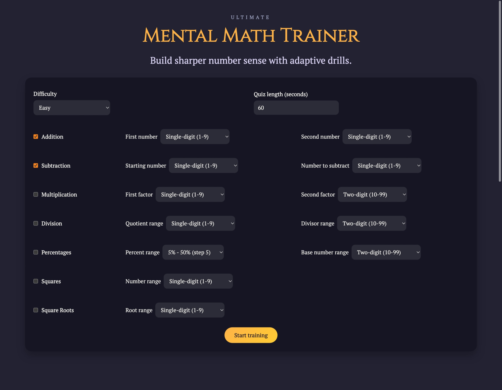
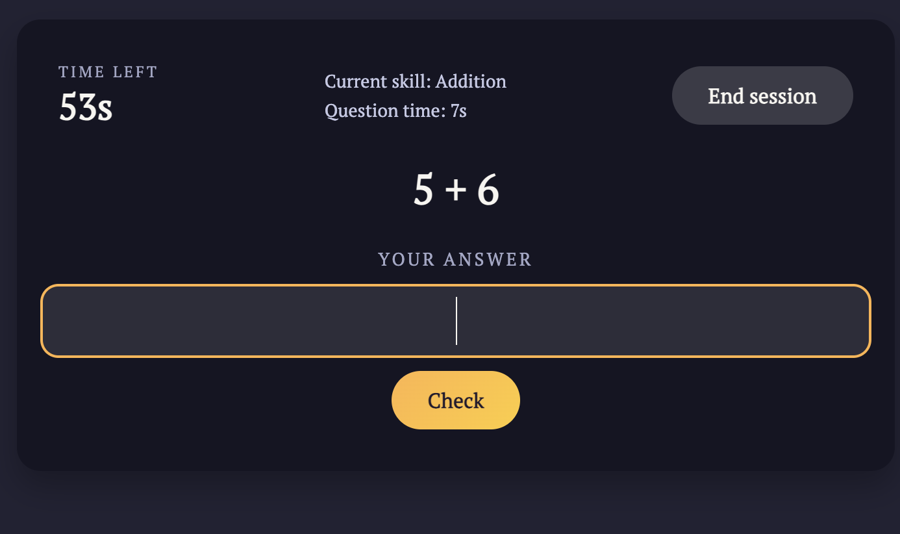

# Mental Math Trainer

Mental Math Trainer is a Vue 3 app for practicing arithmetic in short, interactive sessions. It adapts to your skill level and is perfect for daily warm-ups or focused practice.

## Features

- Choose from preset difficulties or create custom quizzes
- Toggle operations and set number ranges
- Real-time timers for sessions and questions
- Instant feedback and keyboard-first controls
- Detailed session logs and replay options

Practice Dashboard 

Live Quiz 

### Tech Stack
- Vue 3 
- Vite 
- CSS modules 

### Prerequisites
- Node.js 18+
- npm 9+

### Installation
1. Clone this repo
2. Run `npm install`
3. Start dev server: `npm run dev`
4. Open the local URL (usually `http://localhost:5173`)

### Production Build
- Build: `npm run build`
- Preview: `npm run preview`

